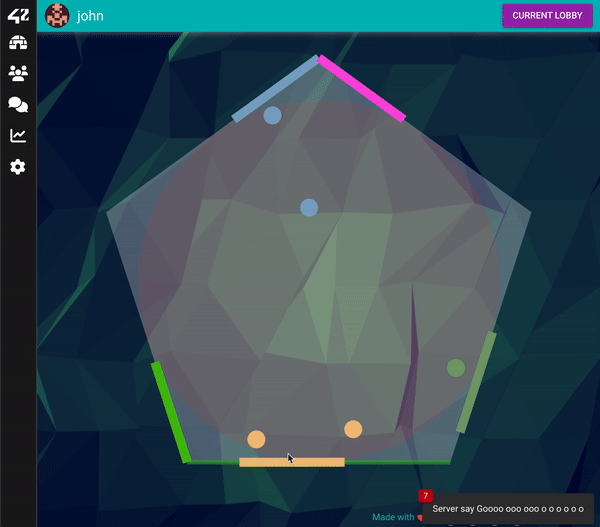

# polypong
---

## Usage

Fill the .env file from .env.example
```
  make prod
```
---

## Description
Final project of the 42 Cursus

This is a multiplayer pong game with social features (chatrooms, friendslist)

### Goal

The game is played on a polygon. Each player is given a side to defend.

When a player gets knocked-out, a new round starts on a polygon with one less side.

The last one standing is the winner.

## Built with:
  - Back: NestJS, TypeOrm, Swagger, Passort: Jwt + Oauth 42/Google
  - Data: PostgresSQL, Redis,
  - Front: VueJS 3.0 (With composition API only), Quasar, PiniaJS, Mande, VueUse, AnimeJS
  - Other: Docker, Docker Compose, Nginx as reverse proxy, Mailhog, Geometric.js, Collider2d, Flat Surface Shaders, Socket.io





---

Credits : adda-sil, edal--ce, gozsertt
